# Trek
A Binding of Isaac inspired game where a player must complete a number of trials in order to become a master wizard.

## Summary:
This arduous trek consists of four main challanges, the main character must defeat one great wizard that came before them, defeat their deepest fears and regrets and finally perform the ultimate feat of dragon slaying. Only upon completing each task will you be able to call yourself a master wizard. The game is broken down into randomly generated dungeons with random enemies for each of the four trials. At the end of each trial there is a special boss to be defeated.

## Controls:
(The in game illustration of the button layout is incorrect in regards to movement and attacking, this is the correct layout)
* W, A, S, D - Movement
* Arrow Keys - Attack
* E - Place a bomb down
* P - Pause the game
* G - Godmode

## HUD:
The top left corner contains health, bomb amount and key amount of the player.
The top right corner contains the map of all discovered rooms with the current room being filled with red. Rooms that have been discovered appear in grey and rooms that have been discovered, but not explored appear in black. 

## Player:
* The player is able to shoot their enemies using magic and place bombs to destroy enemies and obstacles alike.
* When the player is hit they get invincibility frames, indicated by the character sprite blinking, for a short time period.

## Items:
Various items are spawned at the center of each room that contains enemies upon their defeat. 
* **Secret Room Key:** Can be used to unlock magenta coloured doors that randomly spawn around levels. These rooms contain special buffs that enhance the player's attributes.
* **Bombs:** Bombs that can be placed down by the player.
* **Health:** Extra health that the player can use to heal themselves.
* **Various Upgrades:** Upgrades found in secret and hidden rooms, enhance the player's speed, health, damage and fire rate. 

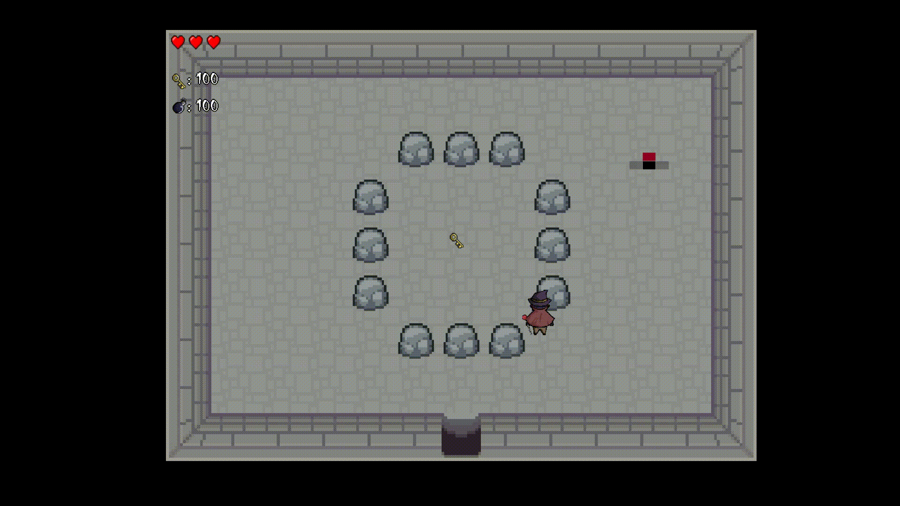 
*Bomb demonstration* 
*Note: GIF speed is slower than actual game speed* 

## Progressing to Next Levels:
In order to progress through the game you have to find the final boss of each dungeon and defeat it. Upon its defeat
a trapdoor will appear in the boss room. Walk over the door in order to descend to the next level.

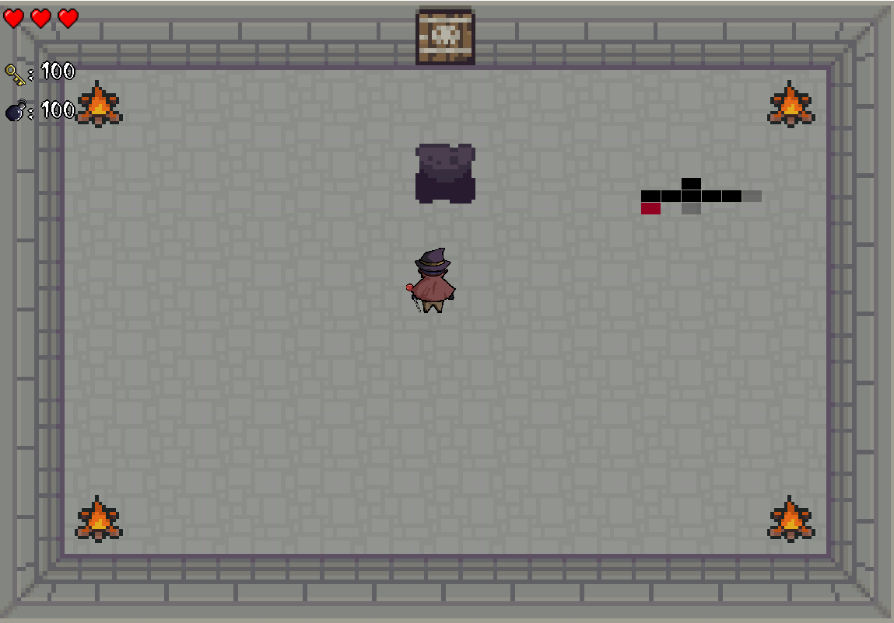 
*Trapdoor after Boss Kill* 

## Rooms:
* Upon entering a room it cannot be exited until all enemies are eliminated.
* Magenta doors indicate a secret room that requires a key to unlock. 

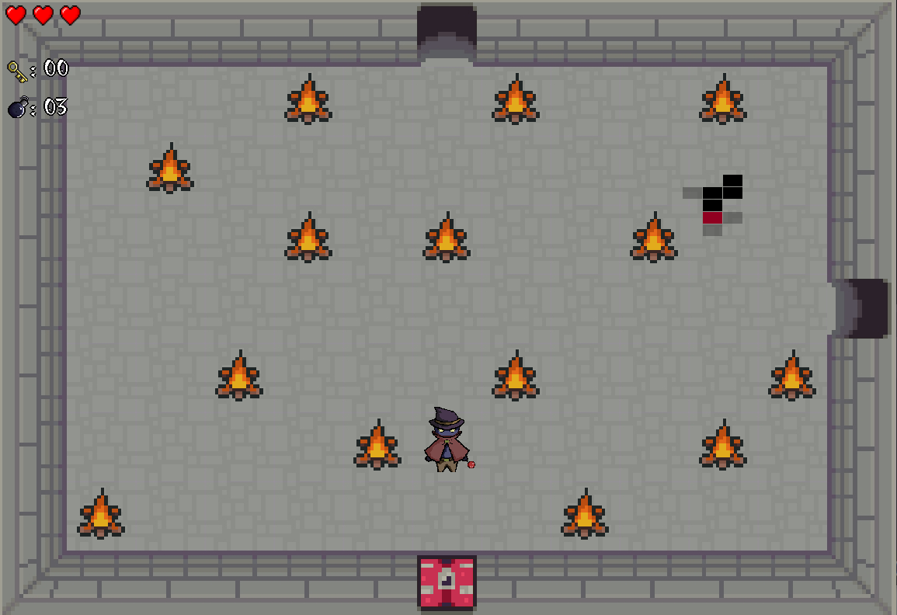 
*Outside of a Secret Room* 

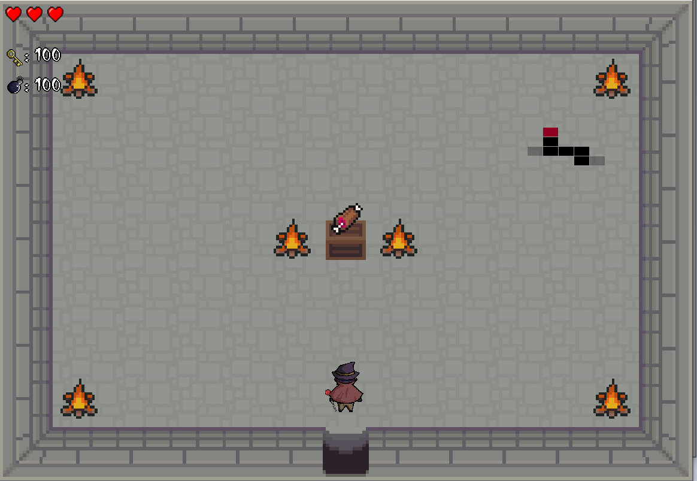 
*Inside of a Secret Room* 

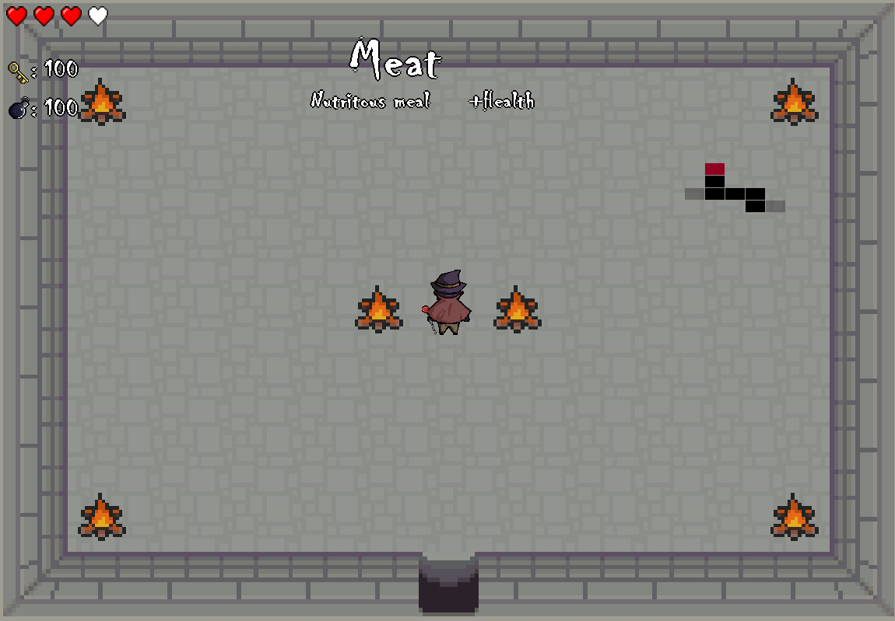 
*Picking up a power up* 

* There are hidden treasure rooms that are only unlocked by placing a bomb next to a wall where you think one might be.
* Boss rooms are indicated by a skull and bones on their doors.

## Enemies:
* Most enemies, except for the blue slimes and bosses, are able to fly over objects (including the eyballs). 
* Bats will run away from you and spawn up to 3 other enemies that attack you.
* Enemies that don't shoot anything can only deal damage upon collision with the player. 

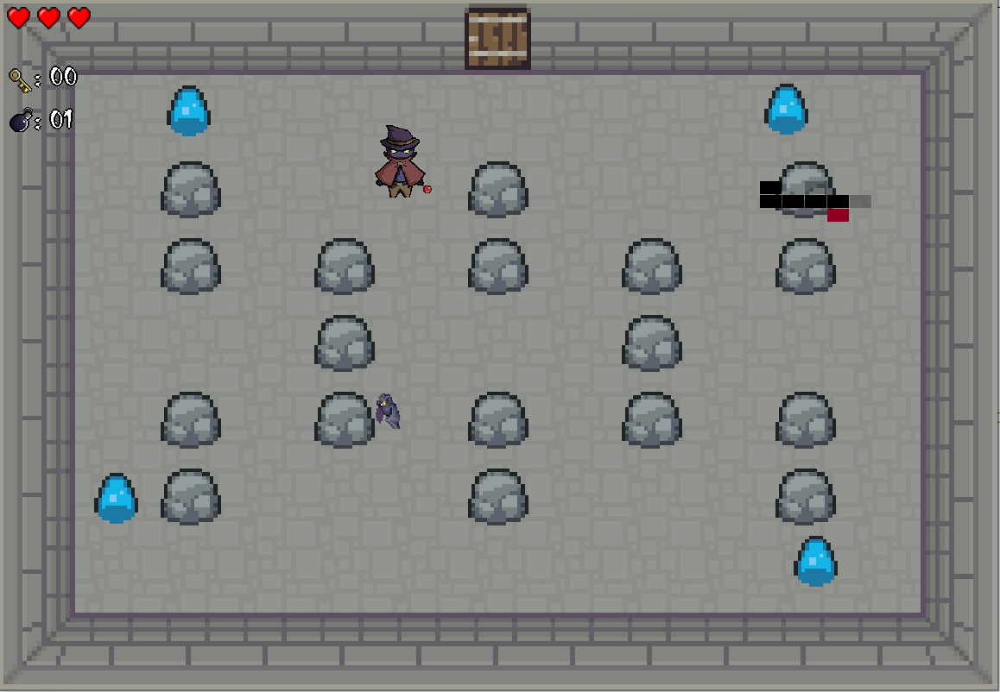 
*Sample Room 1* 

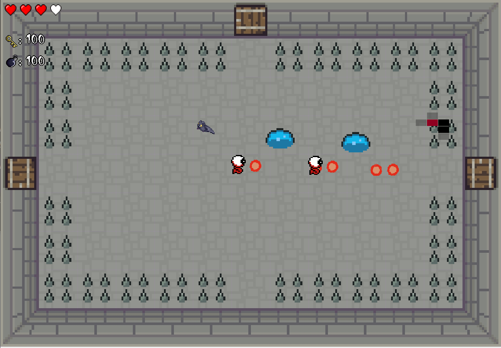 
*Sample Room 2* 

## Bosses:
* There are a total of four bosses that have to be defeated to complete the game.
* Malformed Alchemist Sandaval and Regret spawn minions that have to be eliminated before being able to damage the boss. 
* Each boss has a unique AI behaviour. 

### Sandaval, the Malformed Alchemist
Sandaval will slowly follow the player in an attempt to devour them. If threatened, it shoots a radial blast of magic. 

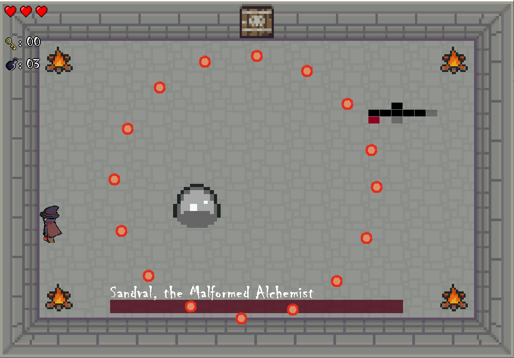 
*Sandaval, the Malformed Alchemist* 

* After taking some damage, Sandaval will summon minions that will prevent him from being damaged.
* Once the last minion is killed Sandaval can be damaged again.

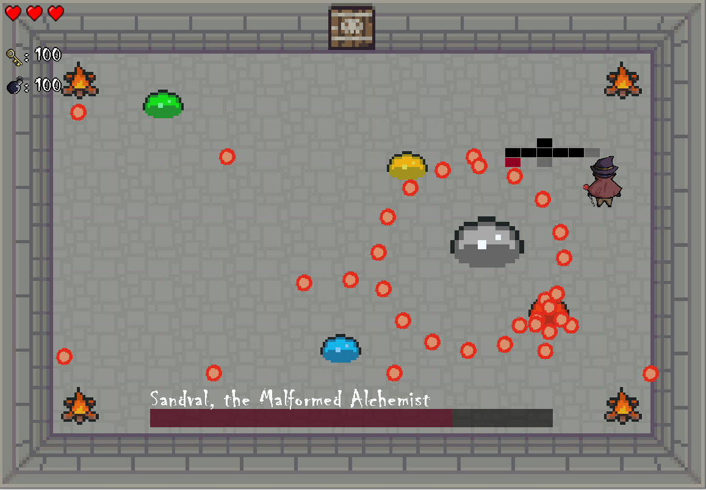 
*Sandaval's minions* 

### Fear
* Fear is able to attack the player using regular magic bursts (not unlike the ones that the player is able to use) as well as shoot a radiual burts of magic when the player gets too close. Fear is also able to dodge the players magic.
* Fear is the representation of the main characters deepest fears.  

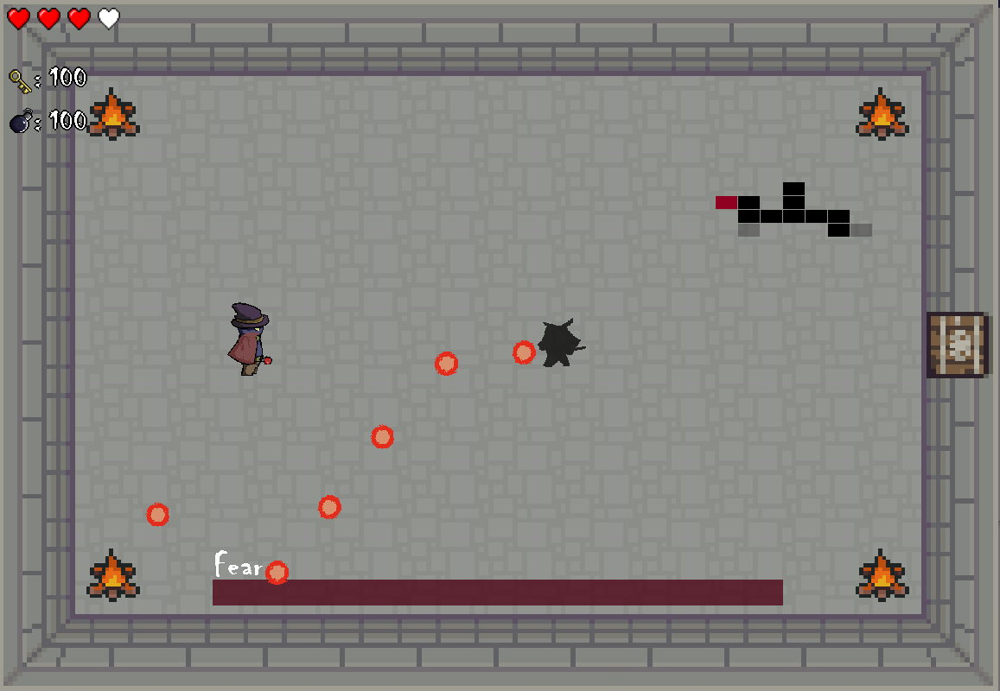 
*Fear* 

### Regret
* Regret is the representation of all regrets that the main character must vanquish in order to become a master wizard. It dashes madly around the room, using its various minions to harm the player.  

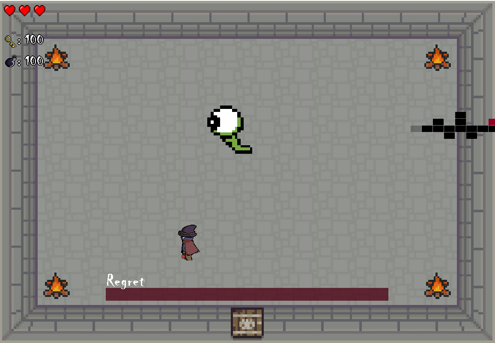 
*Regret* 

### Irgret, the Last Crystal Dragon
* Irgret is able to shoot magic that tracks the player and conjure a radial shield in the form of magic spheres that can harm the player if they hit them. These shield spheres are on a time, but may be consumed to protect Irgret when the palyer's magic hits them. Slaying a dragon is no simple task. The player will have to make sure to visit some secret and hidden rooms to become powerful enough for this task. 

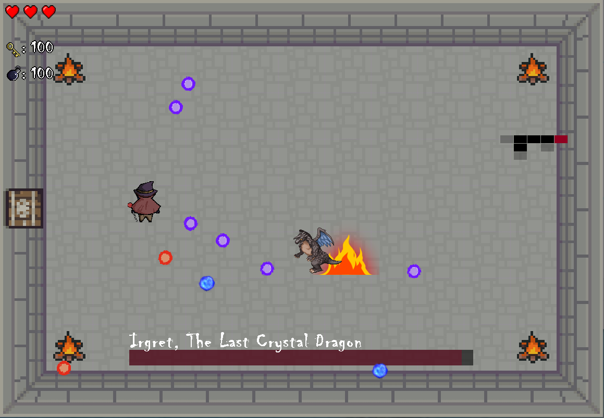 
*Irgret, the last boss of the game* 